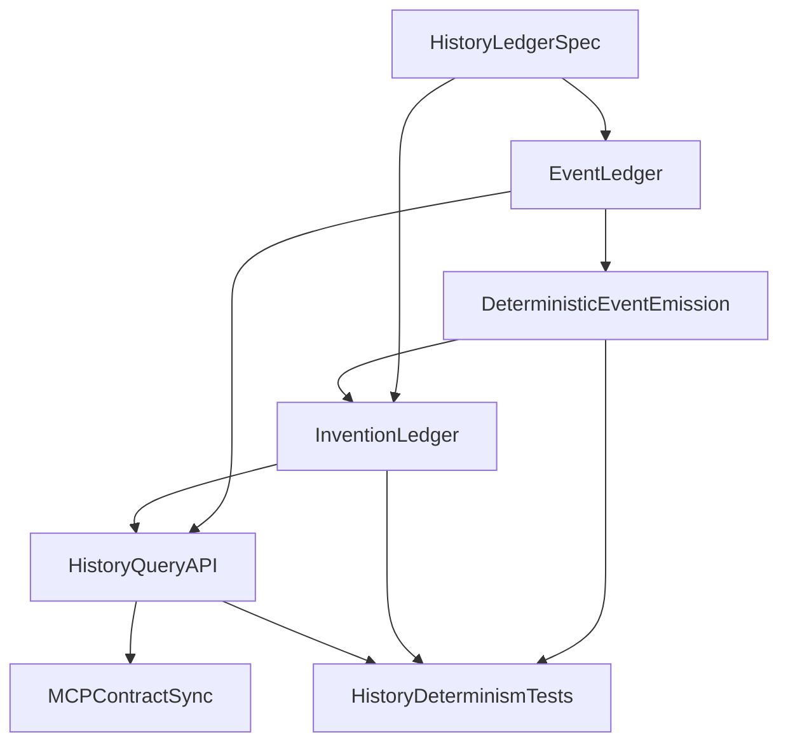

# Sprint 2: History Ledger

## Execution status

- Current phase: Sprint 2 implementation and validation complete
- Active chunk: none
- Next chunk: none (ready for sprint closeout / Sprint 3 planning)
- Blocked items: none
- Last completed chunk: `Task 5b` - timeline ordering/scoping/API contract validation

| Chunk ID | Status | Notes |
| --- | --- | --- |
| Task 1a | completed | Locked `docs/specs/history-ledger-spec.md` with MVP taxonomy, invention rules, timeline mapping, emission points, and reproducibility fields. |
| Task 2a | completed | Added first-class `event` aggregate, repository, deterministic payload converter, and history-era support under backend history packages. |
| Task 2b | completed | Wired deterministic lifecycle/step event emission into `SimulationApplicationService` with explicit tick/category ordering. |
| Task 3a | completed | Added first-class `invention` aggregate/repository with city scoping, source-event key linkage, and deterministic history metadata fields. |
| Task 3b | completed | Implemented deterministic invention derivation from persisted `DISCOVERY_UNLOCKED` event patterns with duplicate prevention. |
| Task 4a | completed | Added city-scoped `/history/events`, `/history/inventions`, and `/history/timeline` APIs plus stable DTO contracts and input validation. |
| Task 4b | completed | Regenerated MCP OpenAPI types, updated MCP backend client + simulation tools for history endpoints, built MCP, and validated an MCP timeline smoke flow. |
| Task 5a | completed | Added reproducibility/idempotence coverage for deterministic event/invention outputs in backend tests. |
| Task 5b | completed | Added history API ordering/scoping/contract checks for timeline surfaces in backend MockMvc tests. |

## Sprint intent

Sprint 2 exists to turn deterministic simulation state into persisted, explainable historical artifacts.

This sprint is intentionally backend-first, but unlike Sprint 1 it must also expose a minimal query surface so timeline data is usable outside the core engine.

It does **not** try to deliver the full frontend experience. Its job is to make simulation history real, queryable, and reproducible.

## Why this sprint comes next

Sprint 1 made the simulation engine deterministic and testable, but the product still cannot explain what happened inside a run.

If Sprint 2 is skipped:

- the frontend will still have no real event or invention data to render
- MCP agents will not have a meaningful historical surface to query
- AI enrichment will have no deterministic source artifacts to enrich
- the simulation will remain technically credible but product-wise opaque

## Sprint outcome

At the end of Sprint 2, a city simulation run should produce deterministic event and invention records, persist them, and expose a minimal city-scoped history query API.

## Sprint scope

### In scope

- define the minimum MVP event and invention ledger semantics
- define deterministic year/era progression rules that map from simulation tick to queryable history metadata
- add persisted `event` and `invention` domain models
- derive deterministic history artifacts from simulation and lifecycle seams
- expose city-scoped event feed, timeline, and inventions endpoints
- align `apps/mcp` with any new history endpoints introduced in this sprint
- add automated tests proving same seed + same steps => same ordered history results

### Out of scope

- frontend timeline, event feed, or invention panel work
- unified simulation snapshot/read-model design for frontend pages
- AI-generated event or invention text as canonical state
- deep multi-era world modeling or calendar realism
- broad PostgreSQL migration or schema-hardening work
- full simulation behavior expansion beyond what is required to emit meaningful deterministic history

## Product and technical decisions for this sprint

### Global decision: every backend endpoint ships with MCP tools

Any new or changed backend API endpoint introduced in this sprint must ship with matching MCP tools and at least one smoke path in the **same sprint chunk**, so flows stay testable from Cursor without depending on the UI.

MCP-proof output requirement for these tools:

- include machine-readable JSON in `content[0].text` (not only a summary string)
- mirror the same payload in `structuredContent`

### Decision 1: history artifacts are deterministic facts, not AI-authored state

Events and inventions created in Sprint 2 must be derived from deterministic backend state only.

AI stays out of:

- canonical event creation
- invention emergence logic
- authoritative year/timeline progression

### Decision 2: use dedicated modules, not the legacy generic `Interaction` stub

Sprint 2 should prefer explicit `event` and `invention` packages/modules over expanding `eu.catlabs.humanaity.entity.Interaction`.

That existing stub can be migrated, deprecated, or left unused temporarily, but it should not remain the semantic center of the history model.

### Decision 3: keep the event schema small and MVP-oriented

Minimum event payload should support:

- city reference
- simulation tick
- event type/category
- ordered actor references
- deterministic payload/details
- importance
- queryable created-at metadata
- derived year/era metadata when needed by the timeline surface

### Decision 4: inventions must be traceable to source events

Minimum invention payload should support:

- city reference
- tick created
- category
- title/summary fields owned by deterministic backend logic for now
- ordered source event references
- impact score or equivalent lightweight ranking signal

### Decision 5: year and era rules should be explicit but simple

Sprint 2 should define one deterministic mapping from tick to year/era metadata and document it in a spec.

Avoid over-designing historical time semantics. The goal is stable product-facing history ordering, not a complete chronology engine.

### Decision 6: backend history endpoint changes must be smoke-testable through MCP

When Sprint 2 adds or changes backend history endpoints, update `apps/mcp` in the same execution loop so the new contract is testable without frontend dependency.

Minimum MCP sync for endpoint changes:

- regenerate MCP OpenAPI types (`npm run api:generate` in `apps/mcp`)
- add or update MCP tool wrappers for new history endpoints under `apps/mcp/src/tools/`
- rebuild MCP (`npm run build`)
- run one smoke flow covering the new event/timeline/invention path

## Deliverables

By the end of Sprint 2, the repo should contain:

- a written history ledger spec for MVP event/invention semantics
- a persisted event model with deterministic emission rules
- a persisted invention model linked to deterministic source events
- city-scoped query endpoints for event feed, timeline, and inventions
- automated tests proving historical outputs are reproducible
- MCP tooling aligned with any new backend history endpoints introduced during sprint execution

## Definition of done

Sprint 2 is done only if all of the following are true:

- a city simulation run can produce persisted event records tied to deterministic state progression
- the timeline/event feed can be queried for a city without synthesizing fake history data
- inventions can be persisted and linked to source events
- same seed + same initial state + same steps produce the same ordered events and inventions
- year/era metadata is deterministic and documented
- if new backend endpoints were added in a chunk, MCP tool generation/wrapping was updated so smoke tests can run through MCP
- the history model no longer depends on the generic `Interaction` stub as its primary semantic home

## Suggested file targets

These are the most likely files or folders Sprint 2 will touch:

- `apps/backend/src/main/java/eu/catlabs/humanaity/simulation/application/SimulationApplicationService.java`
- `apps/backend/src/main/java/eu/catlabs/humanaity/simulation/api/SimulationController.java`
- `apps/backend/src/test/java/eu/catlabs/humanaity/`
- `apps/mcp/src/tools/`

Likely new code areas:

- `apps/backend/src/main/java/eu/catlabs/humanaity/event/`
- `apps/backend/src/main/java/eu/catlabs/humanaity/invention/`
- `apps/backend/src/main/java/eu/catlabs/humanaity/history/`
- `apps/backend/src/main/java/eu/catlabs/humanaity/simulation/api/dto/`
- `docs/specs/history-ledger-spec.md`

## Features and task breakdown

## Feature 1: History ledger specification

### Goal

Define the minimum event, invention, and timeline semantics so implementation stays coherent and deterministic.

### Tasks

1. Define the minimum event taxonomy for MVP history output.
2. Define the minimum invention schema and emergence rules.
3. Define deterministic year/era progression from simulation tick.
4. Define which simulation and lifecycle moments emit events.
5. Define which event/invention fields must be stable for reproducibility testing.

Locked Sprint 2 spec artifact:

- `docs/specs/history-ledger-spec.md`

### Acceptance criteria

- a developer can read the spec and implement event/invention persistence without guessing semantics
- the spec clearly states what is deterministic and what is deferred

### Best owner

- You

## Feature 2: Event ledger persistence

### Goal

Persist meaningful, deterministic event records produced by the simulation.

### Tasks

1. Add an `event` aggregate/entity with city, tick, type, importance, payload, and actor references.
2. Add repository and persistence support.
3. Define stable ordering and identity rules for events emitted within the same tick.
4. Emit deterministic events from simulation/lifecycle seams.
5. Decide how the legacy `Interaction` stub is deprecated, migrated, or left isolated.

Task 2a boundary note:

- keep this chunk focused on domain/persistence scaffolding
- delay emission logic and simulation integration to Task 2b

### Acceptance criteria

- a city run can persist ordered event records
- event creation is driven by deterministic backend logic, not wall-clock timing or AI output

### Best owner

- Cursor chat or Codex

## Feature 3: Invention ledger persistence

### Goal

Persist inventions as deterministic historical artifacts derived from source events.

### Tasks

1. Add an `invention` aggregate/entity with city, tick created, category, title, summary, source event references, and impact score.
2. Add repository and persistence support.
3. Define deterministic invention-emergence rules based on source event patterns.
4. Ensure repeated stepping does not create duplicate inventions for the same deterministic conditions.

### Acceptance criteria

- inventions can be persisted for a city
- each invention links back to deterministic source events or equivalent evidence
- invention creation is reproducible for equivalent runs

### Best owner

- Codex

## Feature 4: History query API and contract alignment

### Goal

Expose the new history model through stable city-scoped contracts that UI and MCP can consume later.

### Tasks

1. Add event feed endpoint(s) for a city.
2. Add timeline endpoint(s) or timeline-oriented projection for a city.
3. Add inventions endpoint(s) for a city.
4. Add DTOs or query models that keep ordering and filtering explicit.
5. Regenerate OpenAPI clients where needed and align MCP tools with the new contract.

### Acceptance criteria

- history data can be queried by city without frontend-only synthesis
- API ordering and scoping are explicit enough for deterministic verification
- MCP can exercise the new endpoint path after contract updates

### Best owner

- Cursor chat

## Feature 5: Determinism and contract validation

### Goal

Make historical reproducibility and API behavior a tested contract.

### Tasks

1. Add a same-seed history equivalence test covering ordered events.
2. Add a same-seed invention equivalence or idempotency test.
3. Add ordering/scoping tests for timeline queries.
4. Run at least one MCP smoke flow for the new history endpoints.

### Acceptance criteria

- deterministic history expectations are covered by automated tests
- regressions in event/invention reproducibility are easy to detect
- contract drift on new history endpoints is caught early

### Best owner

- Codex

## Recommended implementation order

1. Write the history ledger specification.
2. Introduce the event model and persistence.
3. Wire deterministic event emission into simulation/lifecycle flow.
4. Introduce the invention model and deterministic derivation rules.
5. Expose city-scoped query endpoints and DTOs.
6. Update OpenAPI/MCP contract tooling for the new endpoints.
7. Add reproducibility and ordering tests.
8. Clean up any placeholder or legacy history model seams that conflict with the new structure.

## Chunk-by-chunk ownership split (Cursor vs Codex)

Use this split to execute Sprint 2 in reviewable sub-chunks while preserving the five-feature structure above.

| Chunk ID | Chunk focus | Primary owner | Notes |
| --- | --- | --- | --- |
| Task 1a | Write history ledger spec | You | Semantic lock before domain modeling starts. |
| Task 2a | Add event aggregate and repository scaffolding | Cursor | Repo-fitting scaffolding for `event` packages. |
| Task 2b | Emit deterministic events from simulation/lifecycle seams | Codex | Logic-heavy integration with deterministic engine. |
| Task 3a | Add invention aggregate and repository scaffolding | Cursor | Persistence and package placement without emergence logic yet. |
| Task 3b | Derive inventions from deterministic event patterns | Codex | Logic-heavy reproducible history behavior. |
| Task 4a | Add history query endpoints and DTOs | Cursor | Controller/query surface and package alignment. |
| Task 4b | Align OpenAPI/MCP and smoke validate | Cursor | Keep new history contracts testable outside frontend. |
| Task 5a | Add event/invention reproducibility tests | Codex | Determinism regression tests with explicit fixtures. |
| Task 5b | Add timeline ordering and API contract coverage | Codex | Validate city scoping, ordering, and projection expectations. |

Guardrails for this ownership split:

- Cursor owns scaffolding, wiring, package placement, DTOs, controller alignment, and MCP contract updates.
- Codex owns bounded deterministic history emission/derivation logic and determinism-focused tests.
- Determinism tests must use explicit fixtures, not AI-generated or Faker-driven setup.
- Avoid broad "implement Sprint 2" prompts; execute one chunk at a time against this table.

### Codex context contract and Cursor re-integration gates

When delegating a chunk to Codex, always surface durable constraints from repo-visible sources:

- mandatory references in every Codex prompt:
  - this sprint file (`docs/sprints/sprint02/sprint-02-history-ledger.md`) for scope, ordering, and acceptance criteria
  - roadmap scope (`docs/roadmap.md`) for epic alignment
  - history spec (`docs/specs/history-ledger-spec.md`) once Task 1a lands
  - relevant repo rules in `.cursor/rules/` when they encode lasting engineering policy
- do not rely on Cursor-only skills as the sole source of critical implementation constraints
- include a hard boundary line: "Implement only this task ID; do not expand to other sprint tasks"

Cursor must re-integrate after each Codex chunk before moving to the next chunk:

- confirm the change stays within the chunk's in-scope/out-of-scope boundaries
- align package placement, layering, naming, and API shape with existing backend conventions
- run chunk-level tests and compare outcomes to this sprint's acceptance criteria and definition of done
- update sprint/spec docs if implementation changed sprint-shaping decisions

## Per-chunk review, test, and handoff loop

Use the durable rule in `.cursor/rules/docs-chunk-review-loop.mdc` as the default gate for every chunk in this sprint (`Task 1a` through `Task 5b`).

Sprint 2 additions:

- in integration checks, explicitly preserve deterministic history generation and stable ordering guarantees
- when backend history endpoints change, include MCP alignment and one smoke validation path in the handoff gate

## Dependencies inside Sprint 2

## Suggested delegation

### Best tasks for you

- define event and invention semantics
- decide minimal taxonomy and year/era mapping
- keep scope discipline on what is deferred
- review whether the history output feels product-meaningful

### Best tasks for Cursor chat

- scaffold `event` and `invention` packages
- add repository/controller/DTO wiring
- align OpenAPI and MCP contract work
- clean up small package-placement inconsistencies around history code

### Best tasks for Codex

- implement deterministic event emission rules
- implement deterministic invention derivation
- write regression tests for ordered event/invention output
- harden same-seed reproducibility behavior

## Ready-to-delegate task list

These tasks are intentionally small, isolated, and testable.

### Task 1

**Title:** Write history ledger spec for events, inventions, and year progression

**Expected output:**

- a short markdown spec
- MVP event taxonomy
- invention emergence rules
- deterministic year/era mapping

### Task 2

**Title:** Add persisted event domain model

**Expected output:**

- event entity/model
- repository and persistence support
- actor/payload structure for deterministic history storage

### Task 3

**Title:** Emit deterministic events from simulation flow

**Expected output:**

- event creation from deterministic state transitions
- stable ordering rules inside a tick
- no AI-authored canonical event generation

### Task 4

**Title:** Add persisted invention model and deterministic derivation

**Expected output:**

- invention entity/model
- source-event linkage
- deterministic invention emergence behavior

### Task 5

**Title:** Expose city-scoped history query API and align MCP

**Expected output:**

- event feed/timeline/inventions endpoints
- DTOs with explicit ordering/filtering
- regenerated `apps/mcp` API types and updated tool wrappers

### Task 6

**Title:** Add reproducibility tests for history output

**Expected output:**

- same-seed event equivalence test
- invention reproducibility or idempotency test
- timeline ordering/scoping validation

## Risks

- inventing too much event taxonomy before the simulation emits enough meaningful deterministic signals
- letting API/read-model ambitions grow into Sprint 3 scope
- mixing AI text generation with canonical history persistence too early
- generating duplicate inventions because deterministic deduplication rules were not defined clearly
- keeping the legacy `Interaction` placeholder alive in a way that muddies ownership of the new history model

## Anti-scope-creep rule

If a task does not directly help create a deterministic, persisted, queryable history ledger, it belongs to a later sprint.

## Handoff to Sprint 3

Sprint 3 should begin only after Sprint 2 delivers stable event and invention persistence with minimal history query APIs.

Sprint 3 focus:

- unified simulation snapshot/read model
- aggregate metrics and city overview contracts
- frontend- and MCP-friendly projection surfaces
- removal of remaining fake UI simulation metadata
