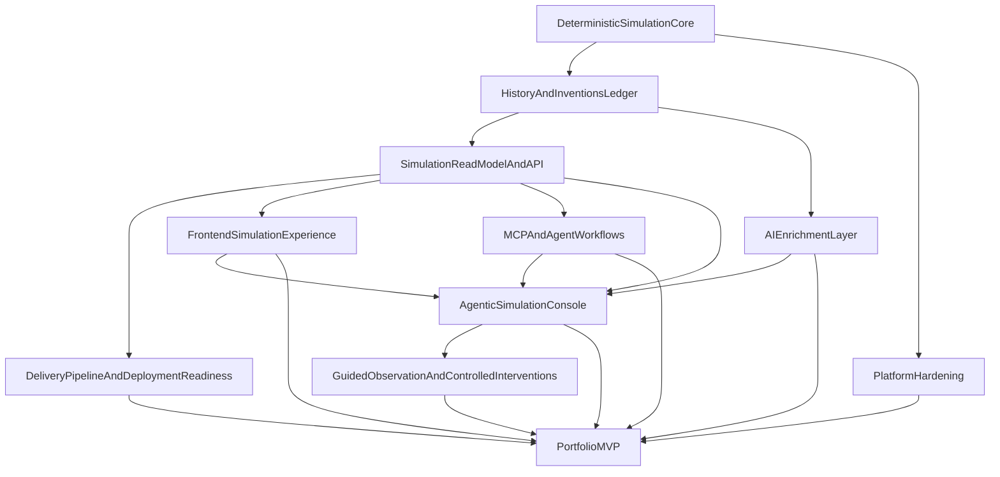

# HUMANAIty Roadmap

## Current repo assessment

HUMANAIty has a strong technical base, but it is still in early alpha product maturity.

- Monorepo contains three real apps: `apps/ui` (Angular), `apps/backend` (Spring Boot), `apps/mcp` (TypeScript MCP).
- Backend is the most mature layer: auth, city management, human generation, simulation control, OpenAPI, and AI provider abstraction already exist.
- Frontend architecture is modern (standalone, lazy routing, signals, Material, SSR), but key simulation pages still contain placeholder/mock-driven UI state.
- MCP server is already functional and is a high-value portfolio differentiator.
- Testing and operational maturity are limited (very low test coverage, H2 + `ddl-auto=update`, no CI pipeline at repo root).

### What already exists

- Auth lifecycle (`signup`, `login`, refresh, logout) and JWT integration.
- City creation linked to automatic human seeding.
- Deterministic simulation foundation in backend: persisted `SimulationRun`, city-scoped lifecycle controls, deterministic `step()` execution, and reproducibility tests.
- Historical event, invention, and timeline persistence/query surfaces.
- Backend-owned simulation snapshot and overview read models for UI and MCP consumers.
- Pixi-based simulation canvas implementation available in UI.
- AI integration layer with fallback behavior in backend, including history enrichment.
- MCP tools for auth/cities/humans/simulation, including recent-change summaries and event explanation workflows.

### Current maturity level

- Product maturity: **Early alpha**
- Architecture maturity: **Promising**
- Portfolio readiness today: **Partial**

### Primary gaps

- Main product UX is still spread across several surfaces instead of one strong simulation-console experience.
- No backend-owned agent orchestration layer exists yet for chat-driven simulation commands.
- The frontend still treats map controls, history reading, and agent workflows as adjacent features rather than one coherent interaction loop.
- Delivery/test maturity is still limited outside the most mature backend slices.

## Product vision

HUMANAIty is an AI-augmented **observation and simulation platform** where autonomous humans interact, exchange knowledge, and generate a coherent historical timeline.

Core principles:

- Backend simulation remains deterministic and reproducible.
- AI enriches narrative artifacts only (dialogue, invention wording, historical recaps).
- UI should converge on one primary simulation-console surface: map first, lightweight context panels, and agent chat as the main interaction loop.
- Agent orchestration belongs in the backend application layer so command policy, auth, tool access, and UI effects remain controlled.
- MCP exposes the same world model for agent-driven exploration and control.
- Every backend feature that matters for iteration must be **MCP-proof**: testable and consumable end-to-end using MCP tools (no UI required).

## MVP definition

### Impressive MVP first (portfolio-maximizing)

A **single-city deterministic civilization sandbox** presented as an **agentic simulation console**:

- User signs up/logs in
- User creates a city
- Backend seeds initial population
- User sees a live simulation map plus one chat-driven control surface
- User asks for safe actions and reads in natural language (`step`, `summarize`, `explain`, `show latest inventions`, `show city state`)
- Backend orchestration interprets the request, executes allowed tools/workflows, and returns UI-friendly effects
- UI refreshes simulation state after allowed actions
- User can still query the same simulation state through MCP tools

### Must-have MVP constraints

- Same seed + same step sequence => same simulation results.
- Events/inventions are persisted and queryable.
- No fake frontend simulation metadata.
- AI output is non-authoritative and traceable to deterministic facts.
- Chat orchestration does not become canonical world state; it only interprets requests, invokes allowed deterministic actions/reads, and explains results.
- Frontend does not orchestrate MCP directly as the primary runtime architecture.
- All critical MVP flows remain executable via MCP tools (auth → city → simulation → read surfaces) so they can be tested manually without the UI.

### Explicitly out of MVP

- Multi-city geopolitics
- Economy depth/resource chains
- Warfare/institutions/world-scale modeling
- Unbounded autonomous agent behavior acting on the simulation without explicit policy
- Production-grade infra completeness

## Epics

## Epic 1: Deterministic simulation core

- **Build order:** Delivered first
- **Status:** Completed in Sprint 1
- **Business/product value:** Defines the platform identity (simulation engine credibility)
- **Technical portfolio value:** Demonstrates deterministic systems design + backend architecture
- **Estimated complexity:** High

### Features

- Simulation run configuration (seed + controls)
- Tick-based deterministic engine
- Persisted simulation run state
- Step/run/pause/resume controls
- Reproducibility checks

### Implementation tasks

- Introduce persisted `SimulationRun` aggregate (seed, tick, status, timestamps).
- Replace unseeded randomness with deterministic seeded randomness.
- Separate pure tick computation from wall-clock scheduling.
- Extend simulation API with lifecycle and deterministic step-friendly endpoints.
- Add deterministic regression tests (same seed => same outputs).

### Dependencies

- Depends on current city/human domain.
- Blocks Epics 2, 3, 4, 5.

## Epic 2: Historical events and inventions ledger

- **Build order:** Second
- **Business/product value:** Makes simulation explainable and meaningful to users
- **Technical portfolio value:** Shows domain modeling and historical state design
- **Estimated complexity:** High

### Features

- Event entity + persistence
- Invention entity + persistence
- Timeline query API
- Event categories (interaction/discovery/dialogue/milestone)
- Era/year progression rules

### Implementation tasks

- Evolve `Interaction` into useful domain model or create dedicated `event` and `invention` modules.
- Define minimal event schema: `cityId`, `tick`, `type`, `actors`, `payload`, `importance`, `createdAt`.
- Define minimal invention schema: `cityId`, `tickCreated`, `category`, `title`, `summary`, `sourceEventIds`, `impactScore`.
- Add endpoints for event feed/timeline/inventions.
- Keep invention emergence deterministic; AI only enriches presentation fields.

### Dependencies

- Depends on Epic 1.
- Feeds Epics 4 and 5.

## Epic 3: Simulation read model and API surface

- **Build order:** Third
- **Business/product value:** Creates clean product-facing contracts for UI and MCP
- **Technical portfolio value:** Demonstrates read-model/API design quality
- **Estimated complexity:** Medium

### Features

- Simulation snapshot endpoint
- Aggregate metrics endpoint
- Event feed endpoint
- Inventions endpoint
- City overview endpoint with real status/year/population metrics

### Implementation tasks

- Add unified simulation snapshot DTO (city/run status/tick/year/humans/metrics/events/inventions).
- Remove frontend need to synthesize fake list metadata.
- Regenerate OpenAPI clients in `apps/ui` and `apps/mcp` at each contract milestone.
- Remove temporary direct `HttpClient` fallback once generated client supports full API.

### Dependencies

- Depends on Epics 1 and 2.
- Unblocks Epics 4 and 7.

## Epic 4: Frontend simulation experience

- **Build order:** After backend core
- **Business/product value:** Delivers portfolio-visible product experience
- **Technical portfolio value:** Highlights modern Angular architecture and interactive systems
- **Estimated complexity:** Medium-high

### Features

- Real city overview list
- Real city simulation detail page
- Live Pixi human map
- Event feed panel
- Inventions panel
- Human detail side panel
- Timeline panel

### Implementation tasks

- Route city detail to data-driven Pixi-capable page and retire placeholder-heavy view.
- Replace mock-derived city list fields with backend values.
- Extend Pixi rendering for real simulation state + entity selection.
- Add timeline/invention/event layout using existing shared UI patterns.
- De-scope or hide admin mock surface until backed by real data.

### Dependencies

- Depends on Epic 3.
- Event/timeline sections depend on Epic 2.

## Epic 5: AI enrichment layer

- **Build order:** During MVP, after deterministic core
- **Business/product value:** Creates distinctive simulation storytelling without compromising determinism
- **Technical portfolio value:** Demonstrates responsible structured AI integration
- **Estimated complexity:** Medium

### Features

- AI-enriched invention title/summary from deterministic invention facts
- AI-enriched dialogue snippets from deterministic event context
- Periodic historical recap generation
- Structured JSON validation + fallback behavior

### Implementation tasks

- Reuse existing backend AI abstraction and provider ports.
- Define strict prompt/response JSON contracts.
- Persist deterministic source data separately from AI-enriched text fields.
- Keep fallback path so simulation runs without LLM availability.

### Dependencies

- Depends on Epics 1 and 2.
- Enhances Epic 4, should not block it.

## Epic 6: Platform hardening

- **Build order:** Parallel, scoped
- **Business/product value:** Increases demo reliability and trust
- **Technical portfolio value:** Shows engineering maturity and quality standards
- **Estimated complexity:** Medium

### Features

- Targeted backend/frontend test coverage
- PostgreSQL-ready migration path
- Config cleanup and environment handling
- Ownership/authorization tightening
- External identity provider readiness (`Keycloak` / OIDC / OAuth2)
- OpenAPI contract alignment

### Implementation tasks

- Add deterministic simulation tests + ownership authorization tests.
- Introduce migration tooling before event/invention schema growth.
- Move toward profile-based config and PostgreSQL-ready setup.
- Fix city update/delete ownership checks.
- Evaluate `Keycloak` as a future identity provider so auth can move from app-local JWT flows toward standard OIDC/OAuth2 flows for UI, backend APIs, and MCP clients.
- Define client/role/scope model for `apps/ui`, `apps/backend`, and `apps/mcp`, including service accounts or delegated access patterns for agent use cases.
- Plan backend resource-server integration around issuer/JWKS-based token validation and role-to-permission mapping.
- Fix stale frontend tests and hardcoded API base URL usage.

### Dependencies

- Can start after MVP scope lock.
- Some tasks should land before portfolio demo publication.

## Epic 7: MCP and agent workflows

- **Build order:** During/just after MVP
- **Business/product value:** Distinctive AI-native platform capability
- **Technical portfolio value:** Strong differentiator in portfolio narrative
- **Estimated complexity:** Medium

### Features

- Simulation snapshot MCP tool
- Timeline query MCP tool
- Inventions query MCP tool
- Event explanation MCP tool

### Implementation tasks

- Extend MCP tools to expose same read models as frontend.
- Keep MVP MCP mostly read-oriented.
- Build one polished demo flow: summarize city changes over last N ticks.
- Prepare MCP authorization for external clients via OIDC/OAuth2 tokens, with `Keycloak` as the default roadmap candidate once MCP flows need scoped third-party access.

### Dependencies

- Depends on Epic 3 read models.
- Event explanation quality improves after Epic 5 enrichment.

## Epic 8: Delivery pipeline and deployment readiness

- **Build order:** After Epic 4 begins (post-E3 contract stabilization)
- **Business/product value:** Makes HUMANAIty reliably buildable and demoable, improving confidence in changes and portfolio readiness without overbuilding infra
- **Technical portfolio value:** Demonstrates pragmatic CI/CD practice, test strategy, and basic deployment discipline
- **Estimated complexity:** Medium

### Features

- Documented testing strategy across backend and frontend
- Automated checks for build, lint, and core tests
- CI pipelines for pull requests and main branch
- Simple non-production deployment target (dev or staging)
- Basic environment configuration model
- Delivery observability and rollback basics

### Implementation tasks

- Define testing strategy:
  - Clarify scope for backend unit tests focused on deterministic simulation logic and key domain invariants.
  - Add backend integration tests for critical simulation and city APIs.
  - Add lightweight frontend unit tests for key components/services (no heavy E2E flows yet).
  - Explicitly defer large E2E suites until MVP simulation and UI stabilize.
- Add baseline automated checks:
  - Ensure backend build (Gradle/Maven) runs cleanly in a non-IDE environment.
  - Ensure frontend build (Angular) runs cleanly from the monorepo root.
  - Wire lint tasks (backend + frontend) into a single commandable pipeline.
  - Add a focused backend test suite to run in CI (simulation core + key APIs).
  - Add a minimal but real frontend test suite to run in CI.
- Introduce CI pipeline:
  - Add pull request validation (build + lint + targeted tests) with clear pass/fail status.
  - Add main branch validation with the same or slightly broader checks.
  - Surface CI status in Git hosting UI to support credible portfolio reviews.
- Prepare deployment architecture:
  - Choose simple deployment targets for backend and frontend (e.g., single container per app or simple app service).
  - Define environment configuration strategy (local vs dev/staging envs, secrets handling, base URLs).
  - Decide on containerization for backend and frontend where appropriate, keeping images simple.
- First non-production deployment:
  - Stand up a dev or staging environment using the chosen deployment targets.
  - Deploy backend and frontend, ensuring connectivity and correct API base URLs.
  - Validate environment configuration (auth, database, AI provider config) against MVP flows.
- Delivery hardening:
  - Improve logging and error visibility for demo-critical paths.
  - Add health checks for backend (liveness/readiness) and a simple frontend availability check.
  - Define a straightforward rollback strategy (e.g., last-known-good build) for non-production.
  - Document release workflow from local change to deployed dev/staging build.

### Dependencies

- Starts after Epic 3 stabilizes the main read models and API surface.
- Runs in parallel with Epic 4 UI work once core contracts are stable.
- Feeds into Epic 6 (Platform hardening) by establishing the baseline delivery and test pipeline.

## Epic 9: Agentic simulation console

- **Build order:** Recommended next product-facing milestone after Epic 7
- **Business/product value:** Creates one coherent flagship user experience instead of a scattered prototype
- **Technical portfolio value:** Demonstrates backend orchestration, AI-assisted tool use, and UI effects on top of deterministic systems
- **Estimated complexity:** High

### Features

- Backend-owned agent orchestration endpoint/service
- Safe MVP natural-language command set
- Map + chat primary simulation surface
- UI effect contract for refresh/focus/highlight behavior
- Clear backend policy separating orchestration from canonical simulation state

### Implementation tasks

- Add a backend orchestration slice that interprets chat requests for one city and executes only allowed commands.
- Define a stable response contract for message text, executed actions, referenced entities, and UI effects.
- Embed a chat panel into the primary simulation surface and refresh snapshot/history after allowed actions.
- Keep MVP commands limited to safe reads plus deterministic step advancement.
- Preserve MCP as a tool/access layer and parity surface, not the app's only runtime backend.

### Dependencies

- Depends on Epics 3, 4, 5, and 7.
- Benefits from Epic 6 hardening but should not wait on broad platform work.
- Becomes the preferred product surface before larger delivery-pipeline investment.

## Epic 10: Guided observation and controlled interventions

- **Build order:** After Epic 9 establishes the console and safe command loop
- **Business/product value:** Expands the console from passive reading to guided exploration and explicit world intervention
- **Technical portfolio value:** Shows policy-aware agent tooling and safe boundaries around simulation control
- **Estimated complexity:** High

### Features

- Guided human-centric observation commands
- Follow/focus/compare workflows tied to map state
- Explicit intervention command model
- Confirmation/audit semantics for director actions

### Implementation tasks

- Add guided commands such as focus human, compare humans, and follow one human for bounded ticks.
- Add UI effects and read-model support needed for tracked/focused human workflows.
- Introduce an explicit intervention model for commands that alter world behavior beyond normal deterministic progression.
- Require confirmation, policy checks, and visible labeling for director actions such as forcing a meeting or guided interaction.
- Record intervention provenance so users can distinguish autonomous simulation history from user-authored interventions.

### Dependencies

- Depends on Epic 9.
- Intervention work may require narrow backend-domain additions beyond orchestration/read layers.
- Should remain scoped and explicit so director controls do not blur deterministic world semantics.

## Features by epic and task dependency map

## Recommended implementation order

1. Lock MVP semantics and deterministic acceptance criteria.
2. Implement deterministic simulation step engine.
3. Add persisted event ledger.
4. Add persisted invention model.
5. Expose simulation snapshot/timeline/event/invention APIs.
6. For every new or changed backend API endpoint, add or update the corresponding MCP tools and smoke tests in the **same sprint**, so flows remain testable without the UI.
7. Rewire city list/detail UI to consume real snapshot data.
8. Add AI-enriched event and invention summaries.
9. Extend MCP with snapshot/timeline-focused tools.
10. Add a backend-owned agent orchestration layer plus safe chat commands on the main simulation surface.
11. Consolidate the UI around a map + chat simulation console with lightweight supporting panels.
12. Add guided human observation commands once the MVP chat loop is stable.
13. Add explicit intervention semantics for director-style commands; keep them visibly separate from normal simulation behavior.
14. Add scoped hardening (tests, config, authorization, contract alignment).
15. Establish testing strategy and baseline automated checks for backend and frontend (build, lint, and focused tests).
16. Introduce CI pipelines for pull requests and main branch validation.
17. Prepare simple deployment architecture and perform a first non-production deployment (dev or staging).
18. Introduce standards-based identity for external clients and MCP access (`Keycloak`/OIDC/OAuth2) once core product flows are stable.

## Suggested delegation

### Best tasks for you

- Define simulation semantics and product boundaries.
- Decide invention/event taxonomy and quality bar.
- Validate narrative quality and portfolio storyline.
- Own scope discipline (what stays out of MVP).

### Best tasks for Cursor chat

- Angular page refactors and routing cleanup.
- API client integration updates.
- DTO/controller/service wiring.
- Focused test additions.
- Config and environment cleanup.

### Best tasks for Codex

- Deterministic simulation refactors with strong tests.
- Backend scaffolding for event/invention modules.
- Repetitive read-model/API mapping work.
- MCP tool expansion and contract-driven adapters.
- Regression tests for snapshot/timeline endpoints.

## Risks and scope control recommendations

- Do not expand to full civilization complexity before deterministic core is solid.
- Keep AI out of canonical state mutation decisions.
- Remove/replace mock UX once real data is available.
- Avoid over-investing in infra polish before simulation depth is credible.
- Optimize for one strong end-to-end demo narrative.
- Keep event timeline + inventions as product center of gravity.
- Prefer one flagship simulation-console flow over multiple equal-status UI surfaces.
- Keep agent chat in a backend-controlled orchestration layer; do not let direct frontend-to-MCP execution become the default app architecture.
- Treat director commands as explicit interventions with auditability, not as normal autonomous simulation behavior.
- Keep `Keycloak`/IdP adoption scoped to standard authn/authz and external MCP access needs; do not let identity platform work delay core simulation credibility.
