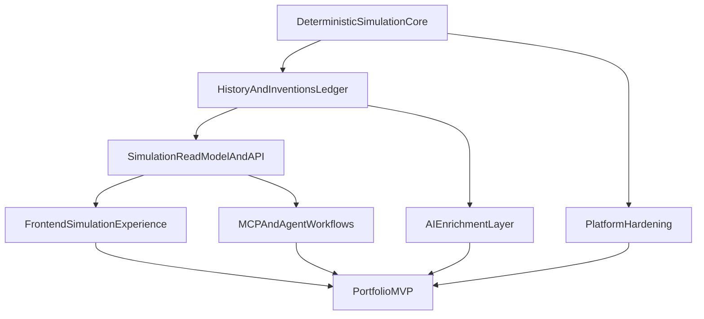

# HUMANAIty Roadmap

## Current repo assessment

HUMANAIty has a strong technical base, but it is still in early alpha product maturity.

- Monorepo contains three real apps: `apps/ui` (Angular), `apps/backend` (Spring Boot), `apps/mcp` (TypeScript MCP).
- Backend is the most mature layer: auth, city management, human generation, simulation control, OpenAPI, and AI provider abstraction already exist.
- Frontend architecture is modern (standalone, lazy routing, signals, Material, SSR), but key simulation pages still contain placeholder/mock-driven UI state.
- MCP server is already functional and is a high-value portfolio differentiator.
- Testing and operational maturity are limited (very low test coverage, H2 + `ddl-auto=update`, no CI pipeline at repo root).

### What already exists

- Auth lifecycle (`signup`, `login`, refresh, logout) and JWT integration.
- City creation linked to automatic human seeding.
- Live simulation loop (currently not deterministic/reproducible).
- Pixi-based simulation canvas implementation available in UI.
- AI integration layer with fallback behavior in backend.
- MCP tools for auth/cities/humans/simulation.

### Current maturity level

- Product maturity: **Early alpha**
- Architecture maturity: **Promising**
- Portfolio readiness today: **Partial**

### Primary gaps

- Determinism gap in simulation engine.
- Missing historical core (events, inventions, timeline as first-class domain).
- Placeholder-heavy UI in critical simulation experience.
- Contract drift in places between backend OpenAPI and frontend usage.
- Minimal tests for core behavior and regressions.

## Product vision

HUMANAIty is an AI-augmented **observation and simulation platform** where autonomous humans interact, exchange knowledge, and generate a coherent historical timeline.

Core principles:

- Backend simulation remains deterministic and reproducible.
- AI enriches narrative artifacts only (dialogue, invention wording, historical recaps).
- UI exposes an explorable, data-rich, interactive simulation surface.
- MCP exposes the same world model for agent-driven exploration and control.

## MVP definition

### Impressive MVP first (portfolio-maximizing)

A **single-city deterministic civilization sandbox**:

- User signs up/logs in
- User creates a city
- Backend seeds initial population
- User starts/steps deterministic simulation
- User observes humans + metrics on live map
- User sees event feed + timeline + inventions generated from deterministic state
- User sees AI-enriched summaries/dialogues linked to deterministic source events
- User can query same simulation state through MCP tools

### Must-have MVP constraints

- Same seed + same step sequence => same simulation results.
- Events/inventions are persisted and queryable.
- No fake frontend simulation metadata.
- AI output is non-authoritative and traceable to deterministic facts.

### Explicitly out of MVP

- Multi-city geopolitics
- Economy depth/resource chains
- Warfare/institutions/world-scale modeling
- Production-grade infra completeness

## Epics

## Epic 1: Deterministic simulation core

- **Build order:** First
- **Business/product value:** Defines the platform identity (simulation engine credibility)
- **Technical portfolio value:** Demonstrates deterministic systems design + backend architecture
- **Estimated complexity:** High

### Features

- Simulation run configuration (seed + controls)
- Tick-based deterministic engine
- Persisted simulation run state
- Step/run/pause/resume controls
- Reproducibility checks

### Implementation tasks

- Introduce persisted `SimulationRun` aggregate (seed, tick, status, timestamps).
- Replace unseeded randomness with deterministic seeded randomness.
- Separate pure tick computation from wall-clock scheduling.
- Extend simulation API with step/snapshot-friendly endpoints.
- Add deterministic regression tests (same seed => same outputs).

### Dependencies

- Depends on current city/human domain.
- Blocks Epics 2, 3, 4, 5.

## Epic 2: Historical events and inventions ledger

- **Build order:** First
- **Business/product value:** Makes simulation explainable and meaningful to users
- **Technical portfolio value:** Shows domain modeling and historical state design
- **Estimated complexity:** High

### Features

- Event entity + persistence
- Invention entity + persistence
- Timeline query API
- Event categories (interaction/discovery/dialogue/milestone)
- Era/year progression rules

### Implementation tasks

- Evolve `Interaction` into useful domain model or create dedicated `event` and `invention` modules.
- Define minimal event schema: `cityId`, `tick`, `type`, `actors`, `payload`, `importance`, `createdAt`.
- Define minimal invention schema: `cityId`, `tickCreated`, `category`, `title`, `summary`, `sourceEventIds`, `impactScore`.
- Add endpoints for event feed/timeline/inventions.
- Keep invention emergence deterministic; AI only enriches presentation fields.

### Dependencies

- Depends on Epic 1.
- Feeds Epics 4 and 5.

## Epic 3: Simulation read model and API surface

- **Build order:** First
- **Business/product value:** Creates clean product-facing contracts for UI and MCP
- **Technical portfolio value:** Demonstrates read-model/API design quality
- **Estimated complexity:** Medium

### Features

- Simulation snapshot endpoint
- Aggregate metrics endpoint
- Event feed endpoint
- Inventions endpoint
- City overview endpoint with real status/year/population metrics

### Implementation tasks

- Add unified simulation snapshot DTO (city/run status/tick/year/humans/metrics/events/inventions).
- Remove frontend need to synthesize fake list metadata.
- Regenerate OpenAPI clients in `apps/ui` and `apps/mcp` at each contract milestone.
- Remove temporary direct `HttpClient` fallback once generated client supports full API.

### Dependencies

- Depends on Epics 1 and 2.
- Unblocks Epics 4 and 7.

## Epic 4: Frontend simulation experience

- **Build order:** After backend core
- **Business/product value:** Delivers portfolio-visible product experience
- **Technical portfolio value:** Highlights modern Angular architecture and interactive systems
- **Estimated complexity:** Medium-high

### Features

- Real city overview list
- Real city simulation detail page
- Live Pixi human map
- Event feed panel
- Inventions panel
- Human detail side panel
- Timeline panel

### Implementation tasks

- Route city detail to data-driven Pixi-capable page and retire placeholder-heavy view.
- Replace mock-derived city list fields with backend values.
- Extend Pixi rendering for real simulation state + entity selection.
- Add timeline/invention/event layout using existing shared UI patterns.
- De-scope or hide admin mock surface until backed by real data.

### Dependencies

- Depends on Epic 3.
- Event/timeline sections depend on Epic 2.

## Epic 5: AI enrichment layer

- **Build order:** During MVP, after deterministic core
- **Business/product value:** Creates distinctive simulation storytelling without compromising determinism
- **Technical portfolio value:** Demonstrates responsible structured AI integration
- **Estimated complexity:** Medium

### Features

- AI-enriched invention title/summary from deterministic invention facts
- AI-enriched dialogue snippets from deterministic event context
- Periodic historical recap generation
- Structured JSON validation + fallback behavior

### Implementation tasks

- Reuse existing backend AI abstraction and provider ports.
- Define strict prompt/response JSON contracts.
- Persist deterministic source data separately from AI-enriched text fields.
- Keep fallback path so simulation runs without LLM availability.

### Dependencies

- Depends on Epics 1 and 2.
- Enhances Epic 4, should not block it.

## Epic 6: Platform hardening

- **Build order:** Parallel, scoped
- **Business/product value:** Increases demo reliability and trust
- **Technical portfolio value:** Shows engineering maturity and quality standards
- **Estimated complexity:** Medium

### Features

- Targeted backend/frontend test coverage
- PostgreSQL-ready migration path
- Config cleanup and environment handling
- Ownership/authorization tightening
- OpenAPI contract alignment

### Implementation tasks

- Add deterministic simulation tests + ownership authorization tests.
- Introduce migration tooling before event/invention schema growth.
- Move toward profile-based config and PostgreSQL-ready setup.
- Fix city update/delete ownership checks.
- Fix stale frontend tests and hardcoded API base URL usage.

### Dependencies

- Can start after MVP scope lock.
- Some tasks should land before portfolio demo publication.

## Epic 7: MCP and agent workflows

- **Build order:** During/just after MVP
- **Business/product value:** Distinctive AI-native platform capability
- **Technical portfolio value:** Strong differentiator in portfolio narrative
- **Estimated complexity:** Medium

### Features

- Simulation snapshot MCP tool
- Timeline query MCP tool
- Inventions query MCP tool
- Event explanation MCP tool

### Implementation tasks

- Extend MCP tools to expose same read models as frontend.
- Keep MVP MCP mostly read-oriented.
- Build one polished demo flow: summarize city changes over last N ticks.

### Dependencies

- Depends on Epic 3 read models.
- Event explanation quality improves after Epic 5 enrichment.

## Features by epic and task dependency map

## Recommended implementation order

1. Lock MVP semantics and deterministic acceptance criteria.
2. Implement deterministic simulation step engine.
3. Add persisted event ledger.
4. Add persisted invention model.
5. Expose simulation snapshot/timeline/event/invention APIs.
6. Rewire city list/detail UI to consume real snapshot data.
7. Add AI-enriched event and invention summaries.
8. Extend MCP with snapshot/timeline-focused tools.
9. Add scoped hardening (tests, config, authorization, contract alignment).

## Suggested delegation

### Best tasks for you

- Define simulation semantics and product boundaries.
- Decide invention/event taxonomy and quality bar.
- Validate narrative quality and portfolio storyline.
- Own scope discipline (what stays out of MVP).

### Best tasks for Cursor chat

- Angular page refactors and routing cleanup.
- API client integration updates.
- DTO/controller/service wiring.
- Focused test additions.
- Config and environment cleanup.

### Best tasks for Codex

- Deterministic simulation refactors with strong tests.
- Backend scaffolding for event/invention modules.
- Repetitive read-model/API mapping work.
- MCP tool expansion and contract-driven adapters.
- Regression tests for snapshot/timeline endpoints.

## Risks and scope control recommendations

- Do not expand to full civilization complexity before deterministic core is solid.
- Keep AI out of canonical state mutation decisions.
- Remove/replace mock UX once real data is available.
- Avoid over-investing in infra polish before simulation depth is credible.
- Optimize for one strong end-to-end demo narrative.
- Keep event timeline + inventions as product center of gravity.
