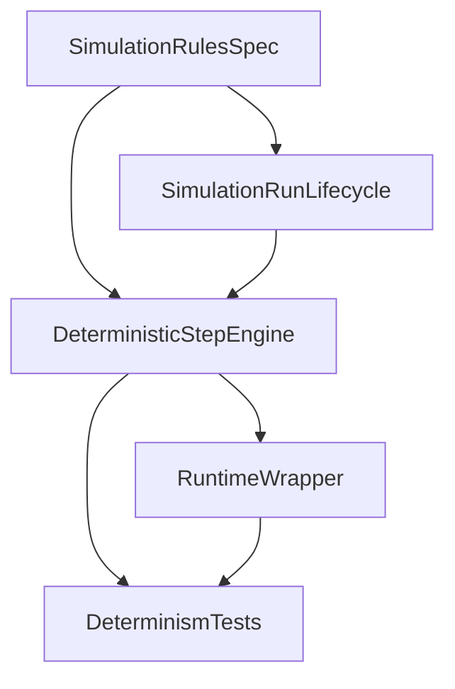

# Sprint 1: Deterministic Simulation Foundation

## Execution status

- Current phase: Feature 3 deterministic step extraction kickoff after lifecycle API alignment
- Active chunk: `Task 3a` - extract pure deterministic `step()` path
- Next chunk: `Task 3b` - enforce deterministic ordering and seeded randomness
- Last completed chunk: `Task 2c` - add/refine API/controller lifecycle surface

| Chunk ID | Status | Notes |
| --- | --- | --- |
| Task 1a | done | `docs/specs/simulation-deterministic-spec.md` is locked for Sprint 1. |
| Task 2a | done | Domain-only scaffolding (`SimulationRun` + status enum) completed; API/read-model work deferred. |
| Task 2b | done | Repository and lifecycle service wiring for the city-scoped run model is complete. |
| Task 2c | done | City-scoped lifecycle API surface added (`create/load/pause/resume`) with DTOs and controller-level `404` translation while preserving existing `start/stop/status` compatibility. |
| Task 3a | in_progress | Pure deterministic `step()` extraction starts now that lifecycle API surface is aligned. |
| Task 3b | blocked | Depends on deterministic `step()` extraction. |
| Task 3c | blocked | Depends on deterministic `step()` extraction. |
| Task 3d | blocked | Depends on Tasks 3a-3c. |
| Task 3e | planned | Movement smoke mode: remove/neutralize busy-lock behavior so human movement can be observed reliably during smoke validation. |
| Task 4a | blocked | Depends on stable deterministic step engine. |
| Task 4b | blocked | Depends on scheduler wrapper refactor start. |
| Task 5a | blocked | Depends on deterministic step engine readiness. |
| Task 5b | blocked | Depends on run lifecycle and deterministic stepping. |
| Task 5c | blocked | Depends on scheduler/manual-step parity path. |

## Sprint intent

Sprint 1 exists to replace the current prototype simulation loop with a deterministic backend foundation that the rest of HUMANAIty can safely build on.

This sprint is intentionally backend-first.

It does **not** try to make the product feel complete. Its job is to make the simulation core credible.

## Why this sprint comes first

Today, the current simulation in `apps/backend/src/main/java/eu/catlabs/humanaity/simulation/application/SimulationApplicationService.java` is a scheduled random movement loop. That is useful as a prototype, but it conflicts with the product goal of a deterministic civilization simulation platform.

If this is not fixed first:

- the future event timeline will not be trustworthy
- inventions will not be reproducible
- frontend work will be built on unstable semantics
- AI enrichment will risk compensating for weak simulation rather than enriching strong simulation

## Sprint outcome

At the end of Sprint 1, HUMANAIty should support a deterministic simulation run per city with a clear tick model and reproducibility tests.

## Sprint scope

### In scope

- define the rules of a simulation tick
- define what simulation state must be persisted
- introduce a `SimulationRun` concept
- refactor simulation logic into deterministic step-based execution
- separate pure simulation logic from scheduling/runtime execution
- add backend tests proving determinism

### Out of scope

- frontend redesign
- timeline UI
- inventions persistence
- AI-generated historical content
- PostgreSQL migration
- broad production hardening

## Product and technical decisions for this sprint

### Decision 1: determinism is a hard requirement

The backend simulation must produce the same result when all of the following are identical:

- same city starting state
- same simulation seed
- same ordered sequence of steps

### Decision 2: AI is not part of the simulation core

Generative AI must not affect canonical simulation state in Sprint 1.

AI stays out of:

- simulation decisions
- human state transitions
- event generation logic

### Decision 3: keep current backend architecture style

Sprint 1 should extend the existing backend structure rather than introduce a conflicting architecture.

Relevant existing areas:

- `apps/backend/src/main/java/eu/catlabs/humanaity/simulation`
- `apps/backend/src/main/java/eu/catlabs/humanaity/city`
- `apps/backend/src/main/java/eu/catlabs/humanaity/human`

### Decision 4: scheduling becomes a wrapper, not the engine

Wall-clock execution may still exist later, but the source of truth must be a pure deterministic `step()` path.

### Decision 5: backend API changes must be smoke-testable through MCP

When a sprint chunk introduces or changes backend API endpoints, update `apps/mcp` in the same execution loop so the new contract is testable without frontend dependency.

Minimum MCP sync for endpoint changes:

- regenerate MCP OpenAPI types (`npm run api:generate` in `apps/mcp`)
- add/update MCP tool wrappers for new endpoints under `apps/mcp/src/tools/`
- rebuild MCP (`npm run build`) and run one smoke flow that exercises the new endpoint path

### Decision 6: movement smoke mode can bypass busy-lock semantics

To keep movement validation observable while deterministic foundations are still evolving, Sprint 1 may temporarily remove or neutralize `busy`-state locking behavior in step execution.

Guardrails for this temporary mode:

- treat this as a testing/usability simplification, not a final behavior contract
- keep the change isolated to simulation step behavior and related DTO/read-model expectations
- do not let this block core deterministic engine work (`Task 3a` to `Task 3d`)
- reintroduce or redesign canonical busy/collision semantics explicitly in a later sprint chunk

## Deliverables

By the end of Sprint 1, the repo should contain:

- a written simulation rules definition for MVP-level stepping
- a persisted `SimulationRun` model or equivalent
- a deterministic step execution flow
- a separation between runtime scheduler and core simulation logic
- automated tests proving reproducibility
- MCP tooling aligned with any new backend API endpoints introduced during sprint execution

## Definition of done

Sprint 1 is done only if all of the following are true:

- a simulation run can be created for a city with a seed
- the simulation can advance by a single deterministic step
- the simulation can advance by multiple deterministic steps
- state progression is based on deterministic logic, not uncontrolled randomness
- at least one automated test proves same seed + same initial state + same steps => same result
- the old simulation loop is either removed or clearly relegated to a thin runtime wrapper
- if new backend endpoints were added in a chunk, MCP tool generation/wrapping was updated so smoke tests can run through MCP

## Suggested file targets

These are the most likely files or folders Sprint 1 will touch:

- `apps/backend/src/main/java/eu/catlabs/humanaity/simulation/application/SimulationApplicationService.java`
- `apps/backend/src/main/java/eu/catlabs/humanaity/simulation/api/SimulationController.java`
- `apps/backend/src/main/java/eu/catlabs/humanaity/human/application/HumanApplicationService.java`
- `apps/backend/src/main/java/eu/catlabs/humanaity/human/domain/Human.java`
- `apps/backend/src/test/java/eu/catlabs/humanaity/`

Likely new code areas:

- `apps/backend/src/main/java/eu/catlabs/humanaity/simulation/domain/`
- `apps/backend/src/main/java/eu/catlabs/humanaity/simulation/infrastructure/`
- `apps/backend/src/main/java/eu/catlabs/humanaity/simulation/api/dto/`

## Features and task breakdown

## Feature 1: Simulation rules specification

### Goal

Define exactly what a tick means so implementation work stays coherent.

### Tasks

1. Define the minimum simulation state for a run.
2. Define what data belongs to the city, the run, and each human.
3. Define what happens during one tick.
4. Define what sources of randomness exist and how they are seeded.
5. Define which outputs must be stable for reproducibility testing.

Locked Sprint 1 spec artifact:

- `docs/specs/simulation-deterministic-spec.md`

### Acceptance criteria

- a developer can read the spec and implement `step()` without guessing core semantics
- the spec clearly states what is deterministic and what is deferred

### Best owner

- You

## Feature 2: Simulation run lifecycle

### Goal

Introduce a first-class simulation run per city.

### Tasks

1. Add `SimulationRun` entity or equivalent aggregate with:
   - city reference
   - seed
   - tick
   - status
   - timestamps
2. Add persistence/repository support.
3. Define run lifecycle states such as `CREATED`, `RUNNING`, `PAUSED`, `COMPLETED`.
4. Add service methods to create, load, pause, and resume a run.

Task 2a boundary note:

- keep this chunk domain-only (`simulation/domain`) and avoid API/read-model changes
- carry API/read-model alignment into Task 2c so city routes/pages remain the primary UX entry point

### Acceptance criteria

- a city can have a persisted simulation run
- simulation state can be resumed without losing determinism assumptions

### Best owner

- Cursor chat or Codex

## Feature 3: Deterministic simulation step engine

### Goal

Replace uncontrolled runtime behavior with a reproducible step-based engine.

### Tasks

1. Extract pure tick logic from the current scheduled simulation flow.
2. Replace direct `new Random()` behavior with seeded deterministic randomness.
3. Ensure update order is deterministic and not dependent on unstable collection ordering.
4. Define how humans are selected/processed during a step.
5. Implement `step(cityId)` or equivalent application service entrypoint.
6. Implement `step(cityId, count)` or repeated deterministic stepping flow.
7. Add movement smoke mode by removing or neutralizing `busy` locking so movement remains observable in short-interval smoke checks.

### Acceptance criteria

- simulation logic can run one step at a time
- repeated runs with the same seed produce the same state transitions
- scheduling is no longer the source of truth
- movement smoke checks can observe position changes without humans becoming permanently stuck behind busy-lock semantics

### Best owner

- Codex

## Feature 4: Runtime wrapper over deterministic core

### Goal

Preserve usability without making runtime scheduling part of the core model.

### Tasks

1. Keep or reintroduce start/stop behavior as a wrapper over repeated `step()`.
2. Ensure runtime loop only delegates to deterministic stepping.
3. Remove any logic from the scheduler that mutates state outside the deterministic engine.

### Acceptance criteria

- wall-clock execution is optional and thin
- deterministic logic remains testable without background threads

### Best owner

- Cursor chat

## Feature 5: Determinism test suite

### Goal

Make reproducibility a tested contract, not a hope.

### Tasks

1. Add a test for same seed + same initial state + same number of steps.
2. Add a test for different seeds producing different evolutions when expected.
3. Add a test for pause/resume not corrupting run state.
4. Add a test ensuring the scheduler path and manual stepping path converge on the same result.

### Acceptance criteria

- deterministic expectations are covered by automated tests
- regressions in simulation reproducibility are easy to detect

### Best owner

- Codex

## Recommended implementation order

1. Write the simulation rules definition.
2. Introduce `SimulationRun`.
3. Extract deterministic `step()` logic.
4. Wrap runtime scheduling around deterministic stepping.
5. Add reproducibility tests.
6. Clean up any prototype-only simulation behavior that conflicts with the new model.

## Chunk-by-chunk ownership split (Cursor vs Codex)

Use this split to execute Sprint 1 in reviewable sub-chunks while preserving the existing five-feature structure.

| Chunk ID | Chunk focus | Primary owner | Notes |
| --- | --- | --- | --- |
| Task 1a | Write deterministic simulation rules spec | You | Semantic lock before backend refactor starts. |
| Task 2a | Add `SimulationRun` aggregate and status enum | Cursor | Repo-fitting scaffolding in `simulation/domain`. |
| Task 2b | Add persistence and lifecycle service methods | Cursor | Repository + service wiring; no step-engine behavior change. |
| Task 2c | Add/refine API/controller lifecycle surface | Cursor | Controller and DTO alignment for run lifecycle operations. |
| Task 3a | Extract pure deterministic `step()` path | Codex | Logic-heavy extraction from prototype flow. |
| Task 3b | Replace uncontrolled randomness with seeded RNG | Codex | Remove unseeded randomness from core step engine. |
| Task 3c | Enforce deterministic processing order | Codex | Use explicit stable ordering, not implicit repository order. |
| Task 3d | Support repeated deterministic stepping | Codex | Add deterministic multi-step path (`step(..., count)`). |
| Task 3e | Remove/neutralize busy-lock for movement smoke mode | Cursor | Keep movement observable during smoke validation while deterministic core hardening continues. |
| Task 4a | Make scheduler delegate to `step()` only | Cursor | Runtime wrapper over deterministic core. |
| Task 4b | Remove hidden scheduler-owned business logic | Cursor | Scheduler remains orchestration only. |
| Task 5a | Add same-seed reproducibility test | Codex | Determinism regression test with explicit fixtures. |
| Task 5b | Add pause/resume state continuity test | Codex | Validate lifecycle continuity and deterministic assumptions. |
| Task 5c | Add scheduler/manual-step equivalence test | Codex | Assert wrapper path and direct step path converge. |

Guardrails for this ownership split:

- Cursor owns scaffolding, wiring, package placement, and scheduler-wrapper integration.
- Codex owns bounded deterministic engine logic and determinism-focused tests.
- Determinism tests must use explicit deterministic fixtures, not AI/Faker-generated initial state.
- Avoid broad "implement Sprint 1" prompts; execute one chunk at a time against this table.

### Codex context contract and Cursor re-integration gates

When delegating a chunk to Codex, always surface durable constraints from repo-visible sources:

- mandatory references in every Codex prompt:
  - this sprint file (`docs/sprints/sprint-01-foundation.md`) for scope, ordering, and acceptance criteria
  - deterministic rules spec (`docs/specs/simulation-deterministic-spec.md`) for tick semantics and RNG policy
  - relevant repo rules in `.cursor/rules/` when they encode lasting engineering policy
- do not rely on Cursor-only skills as the sole source of critical implementation constraints
- if a skill contains mandatory policy, restate that policy in sprint/spec/rule docs before delegation

Cursor must re-integrate after each Codex chunk before moving to the next chunk:

- re-integration trigger:
  - any Codex code/docs patch proposed or merged for the active chunk
  - any sprint-shaping decision discovered during implementation (scope, ordering, definition-of-done impact)
- re-integration checklist:
  - confirm the change stays within the chunk's in-scope/out-of-scope boundaries
  - align package placement, layering, naming, and API shape with existing backend conventions
  - run chunk-level tests and compare outcomes to this sprint's acceptance criteria and DoD
  - update sprint/spec docs if implementation changed sprint-shaping decisions

## Per-chunk review, test, and handoff loop

Use the durable rule in `.cursor/rules/docs-chunk-review-loop.mdc` as the default gate for every chunk in this sprint (`Task 1a` through `Task 5c`).

Sprint 1 addition:

- in integration checks, explicitly preserve deterministic guarantees and scheduler-vs-step separation

## Dependencies inside Sprint 1

## Suggested delegation

### Best tasks for you

- define sprint success criteria
- define tick semantics
- decide what must stay deterministic
- decide what is intentionally deferred

### Best tasks for Cursor chat

- scaffold `SimulationRun`
- add controller/service/repository wiring
- refactor scheduler into a wrapper
- clean up small backend architecture inconsistencies

### Best tasks for Codex

- implement deterministic stepping mechanics
- harden update ordering
- write deterministic regression tests
- refactor prototype simulation code into smaller testable units

## Ready-to-delegate task list

These tasks are intentionally small, isolated, and testable.

### Task 1

**Title:** Write simulation rules spec for deterministic stepping

**Expected output:**

- a short markdown spec
- tick semantics
- deterministic RNG policy
- in-scope vs deferred simulation rules

### Task 2

**Title:** Add `SimulationRun` domain model

**Expected output:**

- entity/model
- persistence layer
- status enum
- service methods for lifecycle management

### Task 3

**Title:** Refactor simulation service to pure deterministic `step()`

**Expected output:**

- extracted stepping logic
- no uncontrolled randomness in core flow
- deterministic update ordering

### Task 4

**Title:** Rework start/stop runtime loop to call deterministic step engine

**Expected output:**

- runtime wrapper over `step()`
- no business logic hidden in the scheduler

### Task 5

**Title:** Add reproducibility tests for simulation engine

**Expected output:**

- same seed reproducibility test
- pause/resume test
- scheduler/manual-step equivalence test

## Risks

- implementing code before agreeing on tick semantics
- keeping hidden randomness in collection ordering or background scheduling
- over-designing the long-term simulation before the MVP core exists
- leaking future event/invention concerns into Sprint 1 implementation

## Anti-scope-creep rule

If a task does not directly help create a deterministic, testable simulation foundation, it belongs to a later sprint.

## Handoff to Sprint 2

Sprint 2 should begin only after Sprint 1 delivers a stable deterministic foundation.

Sprint 2 focus:

- event ledger
- invention model
- timeline persistence
- first simulation read model for frontend and MCP
